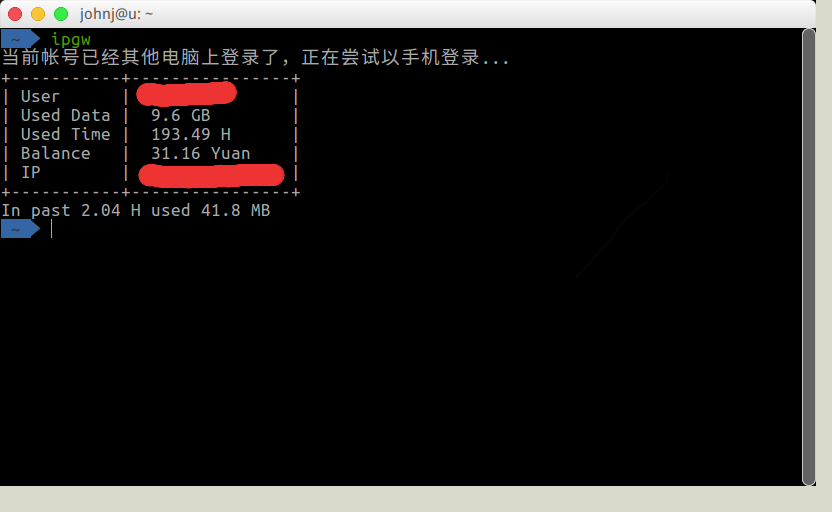

## NEU IPGW 命令行工具



### 安装

```bash
pip install ipgw
```

### 功能

1. `ipgw <id> <password>`  

    运行时提供校园网账号和密码，登录IP网关。  
    如果设置了环境变量`IPGW_ID`和`IPGW_PW`则可省略<id>和<password>参数，其他需要这两个参数的命令也一样。

    Windows系统下可以在`我的电脑-属性-高级系统设置-环境变量`中添加新的变量，变量名分别为`IPGW_ID`和`IPGW_PW`，值分别填写自己校园网账号和密码。
    > **所有的密码设置均只存在于你的本机电脑中，此工具不会保存。**

    *nix系统需要在`~/.bashrc`或者类似的文件中添加以下两行：  
    ```bash
    export IPGW_ID=<your_id>
    export IPGW_PW=<your_password>
    ```

2. `ipgw -o`  
    退出网关。
    > **彩蛋**: 这个 `-o` 选项是可以接受参数的哦，你猜参数是什么？ :stuck_out_tongue_winking_eye:

3. `ipgw -t`  
    测试当前电脑是否联网。

4. `ipgw -f`  
    强制登录。如果有其他设备已登录该账号，则先强制退出，再登录。

### TODO
- [x] 查看流量使用记录
- [x] 添加 log 与错误报警机制
- [x] 自动化运行，去除人工输入部分
- [ ] 查看当前在线设备
- [ ] 打包exe
